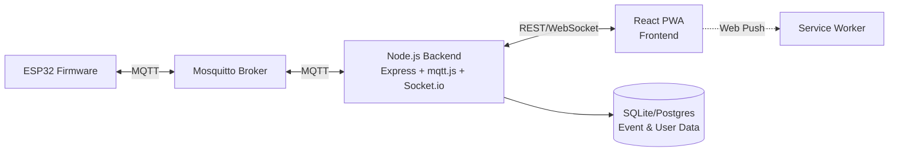
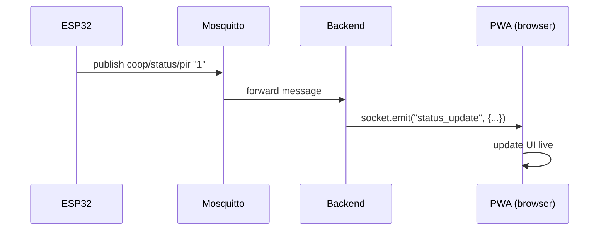
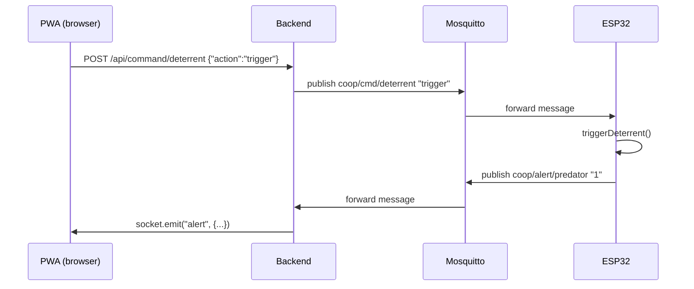
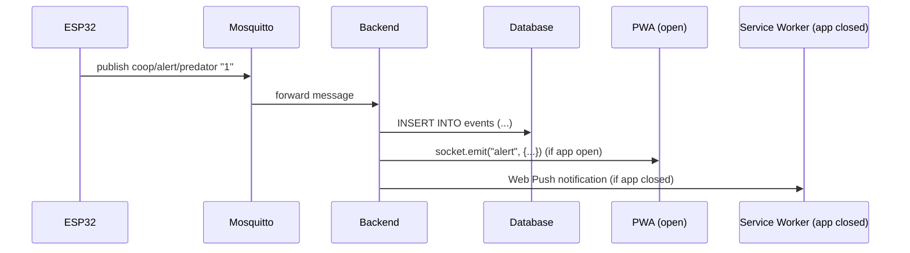
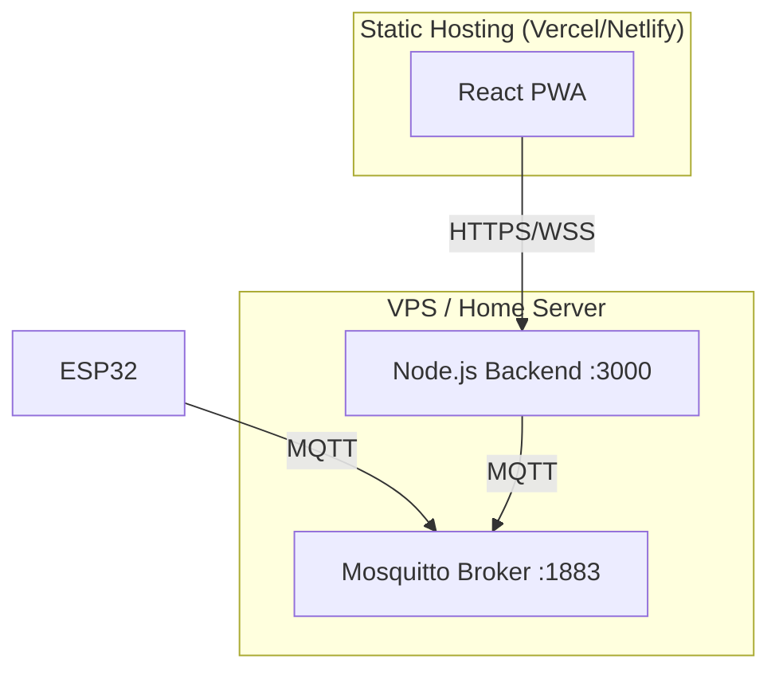

# Smart Coop Predator Deterrent — Full App Development Architecture

**Version 2** — updated to match the current firmware: no servo/door hardware,
LDR is a digital (DO) sensor, buzzer is alarm-only. This document covers the
system architecture, the API contract, the database, the frontend, the
development roadmap, and the testing/deployment plan for the companion app.

---

## 1. Goals

- The app (a PWA) never speaks MQTT directly — it only talks REST + WebSocket
  to our own backend, which is the only thing that touches the broker.
- Live sensor/status updates reach the app in near real time.
- Every predator alert is persisted so the app can show history, not just
  live state.
- The physical deterrent (light/siren/PIR) never depends on the app being
  open or the network being up — the app is a window into the system, not
  a requirement for it to function.
- Simple enough for a small student team to build, run, and demo end-to-end.

## 2. High-Level Architecture



The ESP32 and the backend are the only two things that ever speak MQTT.
Everything downstream (the app, the browser, the user's phone) speaks
ordinary web protocols.

## 3. Component Responsibilities

### 3.1 ESP32 Firmware (existing, current version)
Publishes status/alerts to MQTT, subscribes to 2 command topics. Runs its
own local arm/disarm and deterrent logic independent of the app — the app
can observe and trigger things, but the coop protects itself even offline.

### 3.2 MQTT Broker (Mosquitto)
Private, authenticated, standard `1883` listener. No websocket listener
needed in this design — that's a browser-facing concern the backend
absorbs entirely.

### 3.3 Backend Bridge Service
A single Node.js service with three jobs:
1. **MQTT subscriber** — subscribes to `coop/status/#` and `coop/alert/#`.
2. **Real-time relay** — re-broadcasts incoming messages to connected
   browsers via Socket.io, and writes alert events to the database.
3. **Command API** — REST endpoints that publish `coop/cmd/*` topics back
   to the device.

### 3.4 Database
Stores what MQTT has no memory of: alert/trigger history and user accounts.
SQLite is enough for a school project (single file, zero setup).

### 3.5 PWA Frontend
React app with a service worker (installable, offline-capable shell, push
notifications). Talks to the backend only.

### 3.6 Push Notifications
Backend sends a Web Push message on every `coop/alert/predator` event,
independent of whether the app tab is open.

---

## 4. Current MQTT Topic Map (matches firmware v3 — no door/servo topics)

**Published by the device:**

| Topic | Payload | Meaning |
|---|---|---|
| `coop/status/pir` | `"0"` / `"1"` | motion state |
| `coop/status/light` | `"0"` / `"1"` | LDR digital reading, already polarity-corrected in firmware |
| `coop/status/armed` | `"0"` / `"1"` | armed (dark) or not |
| `coop/alert/predator` | `"1"` | fired once per trigger event |
| `coop/status/online` | `"1"` retained, LWT `"0"` | device connectivity |

**Subscribed by the device:**

| Topic | Payload | Effect |
|---|---|---|
| `coop/cmd/deterrent` | `"trigger"` | force-fire lights/siren |
| `coop/cmd/arm` | `"auto"` / `"on"` / `"off"` | arm mode override |

There is intentionally no door/servo topic in this version — that
hardware isn't in the current build.

---

## 5. Data Flow

### 5.1 Status update (device → app, live)


### 5.2 Command (app → device)


### 5.3 Predator alert (device → app → push notification)


---

## 6. API Contract

### 6.1 REST Endpoints

| Method | Endpoint | Body | Maps to MQTT topic | Notes |
|---|---|---|---|---|
| GET | `/api/status` | — | last-known cached values | full current state snapshot |
| GET | `/api/events?limit=50` | — | reads from DB | history for the "inspect" view |
| POST | `/api/command/deterrent` | `{ "action": "trigger" }` | `coop/cmd/deterrent` | manual test trigger |
| POST | `/api/command/arm` | `{ "mode": "auto" \| "on" \| "off" }` | `coop/cmd/arm` | arm override |
| POST | `/api/auth/login` | `{ "username", "password" }` | — | returns JWT |
| POST | `/api/push/subscribe` | Push subscription object | — | registers device for Web Push |

### 6.2 Socket.io Events (server → client)

| Event | Payload | Fired when |
|---|---|---|
| `status_update` | `{ pir, light, armed, online }` | any `coop/status/*` message arrives |
| `alert` | `{ timestamp }` | `coop/alert/predator` arrives |

---

## 7. Database Schema (SQLite)

```sql
CREATE TABLE users (
  id INTEGER PRIMARY KEY AUTOINCREMENT,
  username TEXT UNIQUE NOT NULL,
  password_hash TEXT NOT NULL,
  created_at DATETIME DEFAULT CURRENT_TIMESTAMP
);

CREATE TABLE events (
  id INTEGER PRIMARY KEY AUTOINCREMENT,
  type TEXT NOT NULL,          -- 'predator_alert' | 'manual_trigger' | 'arm_change'
  detail TEXT,                 -- optional JSON blob, e.g. light/armed state at time of event
  created_at DATETIME DEFAULT CURRENT_TIMESTAMP
);

CREATE TABLE push_subscriptions (
  id INTEGER PRIMARY KEY AUTOINCREMENT,
  user_id INTEGER REFERENCES users(id),
  subscription_json TEXT NOT NULL,
  created_at DATETIME DEFAULT CURRENT_TIMESTAMP
);
```

---

## 8. Auth & Security

- Login issues a JWT (24h expiry), sent as `Authorization: Bearer <token>`.
- All `/api/command/*` endpoints require a valid JWT.
- Backend holds the only MQTT credentials — the browser never sees them.
- CORS restricted to the deployed frontend's origin.

## 9. Frontend Screens (what to actually build)

| Screen | Purpose |
|---|---|
| **Login** | Username/password → JWT stored in memory/localStorage |
| **Dashboard** | Live PIR/light/armed/online status, big "Trigger Test" button |
| **Arm Control** | Toggle Auto / Force On / Force Off |
| **History** | List of past alerts from `/api/events`, newest first |
| **Alert Banner** | Appears app-wide the instant a `socket.io` `alert` event fires |

---

## 10. Project Structure

### Backend
```
backend/
├── src/
│   ├── mqtt/
│   │   ├── client.js         # connects to Mosquitto, subscribes to topics
│   │   └── handlers.js       # parses messages, writes to DB, emits sockets
│   ├── routes/
│   │   ├── status.js
│   │   ├── events.js
│   │   ├── commands.js
│   │   ├── auth.js
│   │   └── push.js
│   ├── db/
│   │   ├── schema.sql
│   │   └── index.js
│   ├── sockets.js
│   └── app.js
├── package.json
└── .env
```

### Frontend
```
frontend/
├── public/
│   ├── manifest.json
│   └── icons/
├── src/
│   ├── components/
│   │   ├── StatusDashboard.jsx
│   │   ├── ArmControl.jsx
│   │   ├── EventHistory.jsx
│   │   ├── AlertBanner.jsx
│   │   └── LoginForm.jsx
│   ├── services/
│   │   ├── api.js
│   │   └── socket.js
│   ├── serviceWorker.js
│   └── App.jsx
└── package.json
```

---

## 11. Development Roadmap

| Phase | What to build | Deliverable |
|---|---|---|
| **1. Broker + Backend skeleton** | Set up Mosquitto, write `mqtt/client.js`, confirm you can log incoming ESP32 messages to console | Backend logs live PIR/light/armed values from the real device |
| **2. Persistence + REST** | Add SQLite, `/api/events`, `/api/status` | `curl` returns real data from the DB |
| **3. Auth** | Login endpoint, JWT middleware | Postman/curl can log in and hit protected routes |
| **4. Realtime bridge** | Socket.io wired to MQTT handler | Open two browser tabs, confirm both update instantly on a live PIR trigger |
| **5. Frontend dashboard** | React app, Dashboard + Arm Control screens | Click "Trigger Test" in the browser, watch the real buzzer/LED fire |
| **6. History + Alert banner** | EventHistory + AlertBanner components | Past alerts show in a list; new alerts pop a banner live |
| **7. PWA + Push** | manifest.json, service worker, Web Push | Install the app on a phone home screen, get a notification with the app closed |
| **8. Polish + deploy** | Error states, loading states, deploy frontend + backend | Live demo-ready URL |

## 12. Testing Strategy

- **Backend:** manual `curl`/Postman tests against each endpoint before building UI against it.
- **Realtime:** use `mosquitto_pub` from a terminal to fake ESP32 messages (`mosquitto_pub -t coop/alert/predator -m 1`) so you can test the app's alert/push flow without needing the real hardware to trigger every time.
- **End-to-end:** trigger the real PIR sensor (wave a hand in front of it while armed) and confirm the alert appears in the app within a couple seconds, and a push notification arrives if the app is closed.
- **Auth:** confirm protected routes reject requests without a valid token.

## 13. Deployment Architecture



## 14. Tech Stack Summary

| Layer | Technology |
|---|---|
| Broker | Mosquitto |
| Backend runtime | Node.js + Express |
| MQTT client (backend) | `mqtt` npm package |
| Real-time transport | Socket.io |
| Database | SQLite (`better-sqlite3`) |
| Auth | `jsonwebtoken` + `bcrypt` |
| Push | `web-push` npm package + VAPID keys |
| Frontend framework | React |
| Frontend real-time client | `socket.io-client` |
| PWA tooling | Vite PWA plugin |
| Frontend hosting | Vercel / Netlify |
| Backend hosting | Same VPS as Mosquitto, or Render/Railway |

## 15. Out of Scope (for this project's size)

- Horizontal scaling / load balancing the backend.
- Multi-tenant support (multiple coops/users beyond a simple login).
- Door/servo control — not in the current hardware build.
